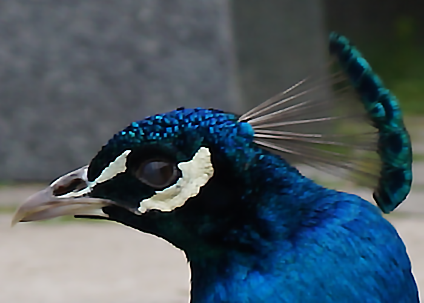
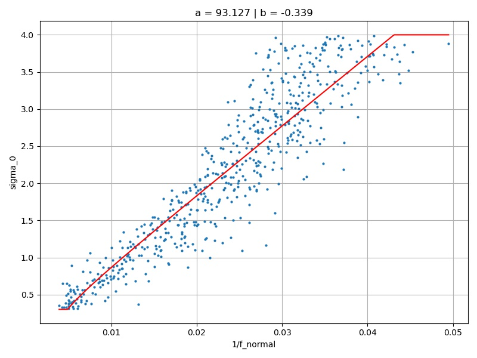

# Non-official Python Implementation of Polyblur

|  |  |
|:------------------------------------------------:|:----------------------------------------------------------------------:|
|        <i>Slightly out-of-focus image</i>        |                 <i>Deblurred result with Polyblur</i>                  |

This repository contains a Python implementation of *Polyblur: Removing mild blur by polynomial reblurring* in
IEEE Transaction on Computational Imaging 2021 by Mauricio Delbracio, Ignacio Garcia-Dorado, Soungjoon Choi, 
Damien Kelly and Peyman Milanfar. We provide Pytorch and Numpy non-official implementations reproducing the quantitative
and qualitative results of the original paper.

A description an analysis of the algorithm can be found in a companion IPOL paper:
*Breaking down Polyblur: Fast blind Correction of Small Anisotropic Blurs* in Image Processing OnLine 2022 by Thomas Eboli, 
Jean-Michel Morel and Gabriele Facciolo.<a href="http://www.ipol.im/pub/art/2022/405/">[paper]</a>
<a href="https://ipolcore.ipol.im/demo/clientApp/demo.html?id=405">[demo]</a>.


### Installation
----------

First install the requirements with
> pip install -r requirements.txt

Second, install the main module with
> python setup.py install

The Pytorch implementation of this code runs **ONLY** with torch 1.10+ 
versions (because of torch.fft for the computation of the gradients with the pytorch implementation).

Alternatively, you can install the package from pypi.org:
> pip install polyblur

### Test
----------


Once done, you can test the blind deblurring technique with
> python main.py --impath ./pictures/peacock_defocus.png --N 3 --alpha 6 --beta 1

You can modify several parameters, e.g. the number of Polyblur iterations and
the deconvolution filter's parameters alpha and beta


### Description
----------

After installation, the package is imported to any project with
```python
import polyblur
```

It contains a main function *polyblur_deblurring* that is agnostic to the input argument img being a (H,W,C) or (H,W) Numpy array or (B,C,H,W) Pytorch tensor. An example reads:
```python
from polyblur import polyblur_deblurring

im_restored = polyblur_deblurring(img, n_iter=3)
```
It runs three iterations of Polyblur with default parameters and returns and Numpy array or a Pytorch tensor depending on the input.


A Pytorch module *PolyblurDeblurring* that inherits from torch.nn.Module is also provided to be put within neurals networks are training losses. 
An example reads:
```python 
from polyblur import PolyblurDeblurring

deblurrer = PolyblurDeblurring()
deblurrer.to(device)

im_restored = deblurrer(img, n_iter=3)
```
It runs three iterations of Polyblur with default parameters and returns a Pytorch tensor.


### Calibration
----------

We also provide a code for reproducing the calibration curves of the original paper with our FFT-based implementation of 
the gradients, or any other one one can image. To compute the slope and intercept 
of the model, please run
> python calibration_blur_parameters.py

Below is an example of the predicted curves for 1% additive Gaussian noise. If you use the exact same implementation 
of the gradients as in this repo, you should find something  like (0.362, -0.468) for the affine model parameters.
You should first provide the path
to the DVI2K validation set.

|  |  |
|:----------------------------------------------------------------:|:------------------------------------------------------------------:|
|                 <i>Principal blur direction</i>                  |                  <i>Orthogonal blur direction</i>                  |


### Roadmap
----------

This code reproduces the results of the TCI'22 article but is not as fast. Even though it is not the
goal of this repository, here are some elements I will enhance in a near future:
* polybur.domain_transform should be implemented with a C++ or CUDA-based normalized convolution to be faster.
* the convolution are too slow with FFT. I should implement it with separable filters as in the TCI paper.


### Contact 
----------

If you encounter any problem with the code, please contact me at <thomas.eboli@ens-paris-saclay.fr>.


### Citation
----------

If this code or the demo are useful for your research, please cite our paper.

```BibTex
@article{eboli22polyblur,
  title={Breaking down Polyblur: Fast Blind Correction of Small Anisotropic Blurs},
  author={Eboli, Thomas and Morel, Jean-Michel and Facciolo, Gabriele},
  journal={Image Processing On Line},
  volume={12},
  pages={435--456},
  year={2022},
}
```
